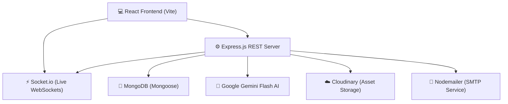

# <p align="center">🦉 SkillBridge: Student Career & Academic Platform 🎓</p>

<p align="center">
  
  
</p>

<p align="center">
  🕊️ <strong>SkillBridge</strong> is a modern MERN-stack student workspace. It seamlessly bridges the gap between academic milestones (attendance forecasting, grade logs, timetable sandboxes) and dynamic career opportunities (job boards, AI resume scorecards, context-aware cover letters, and live application trackers).
</p>

---

## 🔌 Systems Architecture

Here is how the core systems interact in real-time across the platform:



---

## ✨ Primary Platform Modules

### 🎓 1. Academic & College Dashboard
* **📊 Grades & Cumulative Ledger:** Log semester-wise courses and grade details to dynamically auto-calculate live GPA and cumulative CGPA trends.
* **📅 Interactive Weekly Calendar:** Drag, drop, and configure calendar grid slots to build and maintain personal lecture schedules.
* **⚠️ Attendance Ledger & Forecasts:** Track subject-wise attendance logs. Features a forecast engine calculating warning states or class-cut limits to maintain the 75% college threshold.
* **📑 AI Marksheet PDF Ingester:** Upload any university grade sheets as a PDF to automatically scan, extract, verify, and populate course credits directly into your ledger.

### 💼 2. Career & Recruiter Engine
* **🔍 Live Postings Board:** Search and filter internships, full-time career roles, freelance postings, and part-time tasks.
* **🦉 Gaze-Tracking Security mascot:** A beautiful authentication screen with a giant interactive Owl whose eyes dynamically track typing characters when password field is active.
* **📬 Live Application Tracker:** Monitor recruiter action cycles (Submitted, Review, Shortlisted, Selected, Rejected) in real-time with automatic socket alerts.

### 🧠 3. Google Gemini AI Co-Pilot
* **📊 Skill Gap Evaluator:** Cross-references resume strings against job descriptions to output score percentages and curated skill acquisition roadmaps.
* **🎯 ATS Resume Scanner:** Audits resume formatting rules to provide immediate structural feedback and key phrase suggestions.
* **✍️ Adaptive Cover Letter Generator:** Builds tailored cover letters matching 4 customizable tone templates (*Professional*, *Enthusiastic*, *Concise*, *Creative*).
* **💬 Profile-Synced Assistant:** An interactive floating chatbot holding references to your profile milestones to provide guidance.

### 📄 4. Professional Resume Builder
* **📑 Dynamic Layout Templates:** Instantly preview and render portfolios in 3 clean styles: *Minimalist*, *Modern*, and *ATS-Safe*.
* **📏 Live A4 preview Canvas:** A reactive side-by-side editing sandbox mapping changes in real-time.
* **📥 PDF Compile Engine:** Native download pipeline compiling A4 canvas structures into professional static PDFs.

---

## 📂 Repository Workspace Structure

```text
skillbridge/
├── backend/
│   ├── config/          # ⚙️ Database connections & Passport configurations
│   ├── controllers/     # 🕹️ Route controllers (Auth, Academic, Ops, etc.)
│   ├── middleware/      # 🛡️ Session verifiers & request validation rules
│   ├── models/          # 💾 Mongoose Document Schemas
│   ├── routes/          # 🛣️ Express route registrations
│   └── server.js        # 🔌 Server entry point (Express, Sockets, Http)
└── frontend/
    ├── src/
    │   ├── components/  # 🧩 Layouts, visual widgets, notification bells
    │   ├── context/     # 🔒 Global state controls (AuthContext)
    │   ├── pages/       # 📺 Responsive page views (20 unique files)
    │   └── services/    # 📞 API axios client connections
    └── vite.config.js   # 🛠️ Vite bundle configuration
```

---

## ⚙️ Environment Parameters

Create a `backend/.env` file in the backend root directory:

```ini
# Core Configuration 🔌
PORT=5000
MONGO_URI=mongodb://localhost:27017/skillbridge
SESSION_SECRET=YOUR_32_CHAR_RANDOM_SECRET_KEY
CLIENT_URL=http://localhost:5173

# Third-Party API Integrations 🧠
GEMINI_API_KEY=YOUR_GOOGLE_GEMINI_API_KEY
YOUTUBE_API_KEY=YOUR_YOUTUBE_DATA_API_V3_KEY

# Cloud Storage (Cloudinary) ☁️
CLOUDINARY_CLOUD_NAME=YOUR_CLOUDINARY_NAME
CLOUDINARY_API_KEY=YOUR_CLOUDINARY_KEY
CLOUDINARY_API_SECRET=YOUR_CLOUDINARY_SECRET

# Email Service (SMTP / Mailer) 📧
SMTP_HOST=smtp.gmail.com
SMTP_PORT=587
SMTP_USER=YOUR_EMAIL_ADDRESS
SMTP_PASS=YOUR_EMAIL_PASSWORD
```

---

## 🛠️ Local Installation & Launch Guide

### 📋 Prerequisites
* **Node.js** v18.0.0 or higher installed.
* **MongoDB** server running locally or accessible via cloud connection string.

### ⚙️ 1. Start backend Server
```bash
cd backend
npm install
# Configure your .env file inside backend/ directory
npm run dev
```

### 💻 2. Start Frontend App
```bash
cd ../frontend
npm install
npm run dev
```
Explore the workspace live at `http://localhost:5173`.

---

## 🚪 API Navigation Directory

| Namespace | Access Level | Description |
| :--- | :---: | :--- |
| `/api/auth` | 🔓 Public / Session | Sign-up, Sign-in, OAuth providers, OTP verifications, password resets. |
| `/api/users` | 🔒 Session Required | Profile settings, custom skill matrices, resume uploads. |
| `/api/opportunities` | 🔒 Session Required | Job postings feed, opportunity creators, and dynamic metrics. |
| `/api/applications` | 🔒 Recruiter / Student| Submit application tokens, list company workflows, update recruitment logs. |
| `/api/academic` | 🎓 Student Restricted | Academic ledger logs, attendance cards, timetable matrixes. |
| `/api/notifications`| 🔒 User Restricted | Real-time notifications count, read statuses, and alert limits. |
| `/api/resume` | 🎓 Student Restricted | Resume builders data fields, user templates, static PDF generators. |

---

## 🏫 Academic Project Profile

* **🏷️ Project Designation:** SkillBridge — Student Career & Academic Management System
* **👤 Author Name:** Raj Dangui
* **📝 University PRN:** 1292240011
* **🎓 Degree Program:** SY MCA (Master of Computer Applications)
* **🏫 Department Faculty:** Faculty of Management & Technology
* **📍 University Campus:** MIT World Peace University (MIT-WPU), Pune, India
* **👩‍🏫 Project Advisor:** Prof. Sudeepta Banerji
